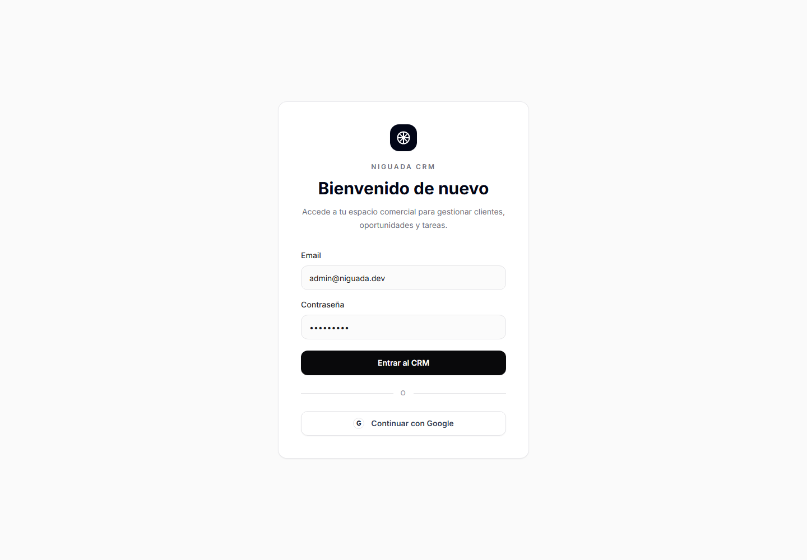
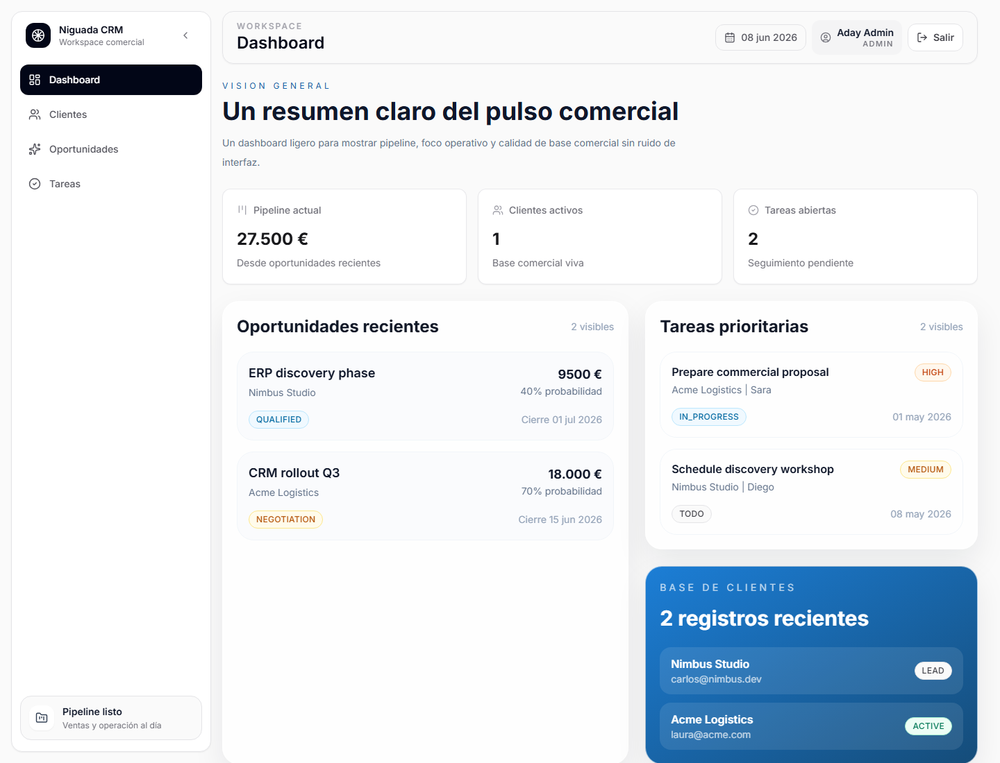
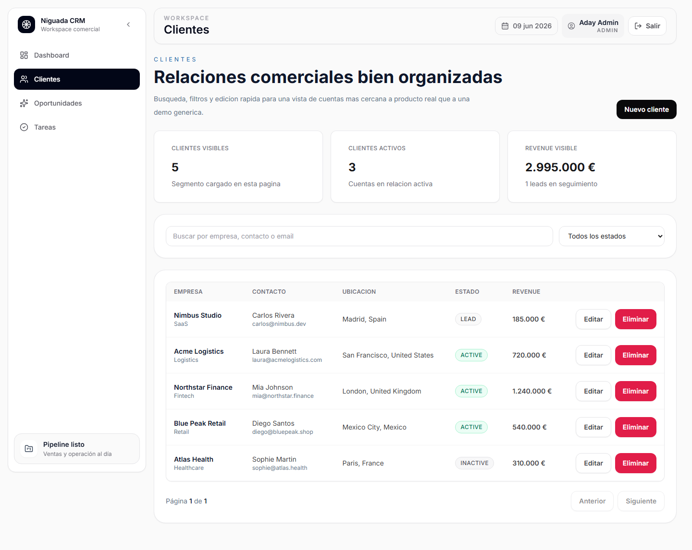

# 🚀 Niguada CRM - The Ultimate Full-Stack Production-Ready Boilerplate

A modern, ultra-clean, and high-performance Mini ERP/CRM Starter Kit built from scratch to help developers, freelancers, and startups save 40+ hours of setup, architecture design, authentication work, database modeling, and production configuration.

Niguada CRM gives you a serious full-stack foundation you can use to build internal tools, client CRM systems, SaaS dashboards, sales portals, admin panels, and business management products faster.

## 🌐 Live Demo & Production Showcase

Test the fully functional production build right now:

🔗 **Live Demo App:** [https://niguada.vercel.app/](https://niguada.vercel.app/)

🔑 **Demo Credentials**

```txt
Email: admin@niguada.dev
Password: Admin123!
```

The demo database is populated with realistic CRM data so you can explore the product immediately: clients, opportunities, tasks, authentication, protected routes, and production-style UI flows.

## 📸 Product Preview

### Login Experience



### Executive Dashboard



### CRM Management



## 🛠️ The Tech Stack (Industry Standards)

This boilerplate is structured with practical, enterprise-inspired architectural patterns:

- **Frontend:** React, TypeScript, Vite, Tailwind CSS, Shadcn-inspired UI components, Lucide Icons.
- **Backend:** Node.js, Express, TypeScript, Prisma ORM, JWT Authentication.
- **Database & Infra:** PostgreSQL, Docker, Docker Compose.
- **Validation:** Zod for strict request validation and safer API contracts.
- **Deployment Ready:** Frontend prepared for Vercel SPA routing and backend-ready production environment configuration.

## ✨ Core Features Included

- **Modular Architecture:** Clean backend structure with separated routes, controllers, services, schemas, middleware, and shared utilities.
- **Robust Authentication:** Secure JWT-based auth flow with login, profile refresh, protected API endpoints, and client-side route guards.
- **Modern UI/UX:** Premium CRM layout with sidebar navigation, responsive tables, metrics, modals, confirmation dialogs, loading states, and clean visual hierarchy.
- **CRM Resource Modules:** Clients, opportunities, tasks, and notes modules designed as realistic business entities instead of toy examples.
- **Sales Pipeline Foundation:** Opportunity stages, probability tracking, estimated values, expected close dates, and pipeline-focused dashboard metrics.
- **Mutation Feedback:** User-friendly success and error feedback for create, update, and delete flows.
- **Automated Seeding:** Local and production-friendly seed scripts to populate the database with realistic demo data.
- **Dockerized Workflow:** Docker and Docker Compose configuration included for a faster full-stack local setup.

## 💻 1-Minute Local Setup

### Backend Configuration

```bash
cd backend
cp .env.example .env
npm install
npm run prisma:generate
npm run prisma:migrate
npm run prisma:seed
npm run dev
```

### Frontend Configuration

```bash
cd frontend
cp .env.example .env
npm install
npm run dev
```

Alternatively, launch the entire ecosystem with Docker:

```bash
docker-compose up --build
```

## 📦 What You Get

- Full React + TypeScript frontend application.
- Express + TypeScript backend API.
- Prisma schema, migrations, and seed scripts.
- JWT authentication flow.
- PostgreSQL database setup.
- Docker production-style configuration.
- Responsive CRM interface.
- Clean folder structure ready to extend.
- Demo data for immediate testing and screenshots.

## 💼 Commercial License & Full Access

Want to use this architecture to build client projects, ship internal tools, or launch your own profitable SaaS faster?

🔗 **Get the Commercial Production License:** [AQUÍ_IRÁ_EL_LINK_DE_TU_TIENDA]

Built with ❤️ by Aday Monzón.
